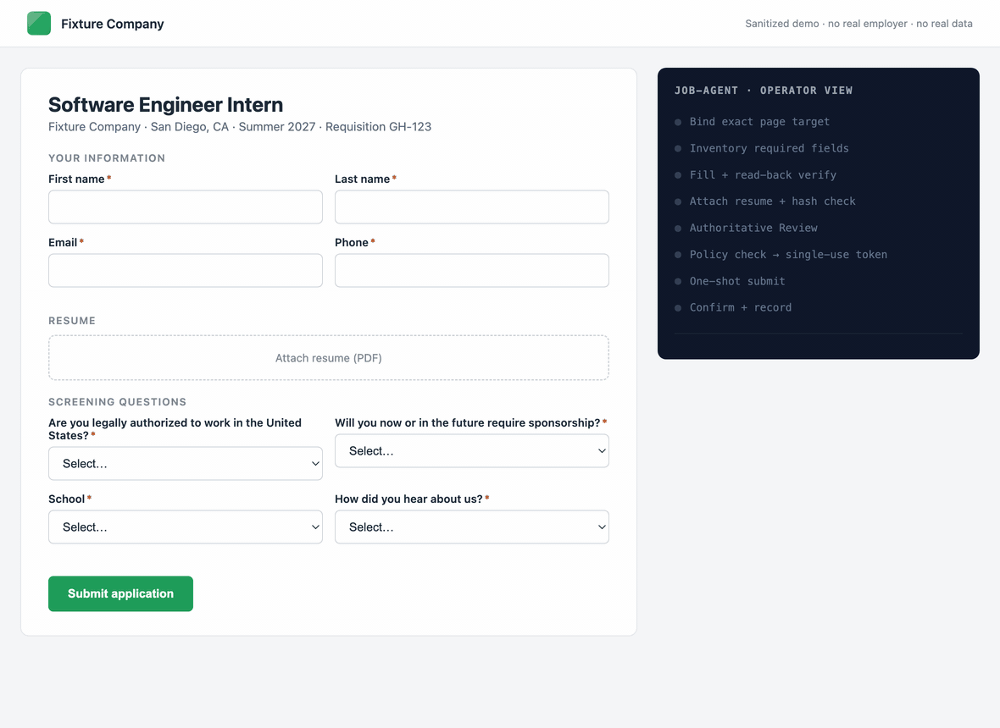

# Job Agent

**A bot that fills out job applications for you while you sleep, from creating accounts to submitting the application.**



<sup>Real Chrome, real code path, fake company. The agent binds one exact page, fills each field, reads it back to prove it saved, hashes the resume, reconciles a Review, passes the policy check, issues itself a single-use token, submits exactly once, and reads the confirmation back. No human touched it. <a href="#try-it-without-touching-a-real-job-posting">Run it yourself.</a></sup>

Applying to internships means typing the same name, school, and phone number into hundreds of nearly identical forms. This project automates that typing. It finds job postings, opens the application form in a real Chrome browser, fills in the answers, verifies every one of them saved, and submits — on its own, around the clock.

---

## The one thing to understand

Most automation tools are built to go fast. This one is built to **refuse to do the wrong thing**.

A job application can only be submitted once. There is no undo button, no "recall message," no way to fix a typo after an employer receives it. So every part of this system is designed around a single rule:

> **If the program isn't certain, it stops. It never guesses.**

That's what lets it run unattended. It doesn't need a human watching because it refuses to act on anything it can't prove.

In the code you'll see this called *fail-closed*. It means the default answer is "no." A step only proceeds when it has proof it should. If something is ambiguous — the page changed, a field didn't save, a question is unfamiliar — the program halts and reports why, instead of pushing forward and hoping.

---

## How it works

The system moves a job through seven stages. Each stage has to prove it succeeded before the next one starts.

```
  1. FIND        Search public job boards for matching internships
       ↓
  2. PREPARE     Open the form in Chrome and fill in every field
       ↓
  3. REVIEW      Re-read the page and confirm every answer actually saved
       ↓
  4. AUTHORIZE   Policy check passes. Issues a one-time, expiring token.
       ↓
  5. SUBMIT      One single click. Cannot be repeated.
       ↓
  6. CONFIRM     Verify with the employer's portal that it truly arrived
       ↓
  7. DELIVER     Log it to the tracker and send a Discord notification
```

**Stage 3 is the important one.** After filling a field, the program doesn't trust that it worked. It reads the page back and compares what's actually there against what it meant to type. This is called *read-back verification*, and it's the reason the system catches a dropdown that silently reset or a file upload that didn't attach.

**Stage 4 is the safety gate.** Once the policy check passes (not a MAANGO company, no CAPTCHA, no assessment, no unknown questions), the system issues itself a token that works exactly once, expires in minutes, and is locked to that specific page. If anything changes between authorization and submission, the token stops working. It cannot authorize one application and accidentally submit a different one.

**Stage 5 can never repeat.** If the connection drops mid-click, the program is forbidden from clicking again. Instead it switches to inspection mode and looks for evidence of what happened. A double-submitted application looks careless to an employer; a delayed one doesn't.

---

## What a "verified" application means here

The program will not report an application as submitted just because the page said "Thank you for applying." A success message is easy to fake and easy to misread.

Instead it requires **two independent sources of proof**:

1. The confirmation page itself, validated by that specific ATS's handler
2. The employer's candidate portal showing exactly one matching application marked `submitted`

If those two disagree, or if the portal shows zero or multiple matches, the result is flagged for human review rather than recorded as a success.

---

## Things it will never do

These aren't limitations to work around — they're deliberate, and they're enforced in code:

| It won't | Why |
|---|---|
| Solve a CAPTCHA | Bypassing a human check is against site terms |
| Complete identity or email verification | That's the human proving it's them, not a bot |
| Take a timed assessment | The answers have to be the applicant's own |
| Invent an answer to an unfamiliar question | A wrong answer on an application is worse than no answer |
| Apply to Meta/Amazon/Apple/Netflix/Google/Microsoft automatically | Big-company applications route to manual review by policy |
| Submit twice | One-shot design, enforced by single-use tokens |
| Store your password | Credentials stay in the macOS Keychain, referenced but never copied |

When it hits one of these, it pauses, keeps the browser tab exactly where it is, notifies you, and waits. After you handle it manually, it picks up where it left off.

---

## Try it without touching a real job posting

The repo ships with fake job application pages so you can watch the whole thing run safely. Nothing here touches a real employer.

**Requires Python 3.11 or newer.** (The code uses `datetime.UTC`, which older versions don't have. macOS ships 3.9 by default, so point at a newer one explicitly.)

```bash
# 1. Confirm your setup is ready
python3 setup_diagnostics.py --skip-browser

# 2. Run the full test suite — 1274 tests, no network access
python3 run_offline_tests.py

# 3. Watch a complete fake application, start to finish
python3 production_operator.py local-demo \
  --resume runtime/sanitized-demo/Resume.pdf \
  --runtime-dir runtime/operator-demo \
  --output runtime/operator-demo/report.json \
  --approve-sanitized-submit
```

That last command launches a real Chrome browser against a local test page and runs all seven stages — including deliberately interrupting the submit step to prove the recovery logic doesn't double-click.

**Re-record the GIF at the top of this page** (submits the local fixture, nothing real):

```bash
python3 tools/record_demo.py --output docs/demo.gif
```

It drives `fixtures/demo_greenhouse_styled.html` through the same `MutableCDPPageAdapter` and `browser_actions` read-back contracts the production path uses, then asserts the fixture reports `submitted` — via the real `inspect_confirmation` read-back — before writing the file.

---

## Job boards it can handle

| Platform | Example employers |
|---|---|
| Greenhouse | Startups, mid-size tech |
| Workday | Large enterprises |
| Lever | Tech companies |
| Oracle Recruiting | Enterprise, government |
| Ashby | Modern startups |
| CGI / Njoyn | Consulting, government |

Each one has its own quirks — Workday hides fields behind multi-step wizards, Greenhouse rebuilds its form when React re-renders, Oracle returns blank pages if you read them too early. Each platform gets a dedicated handler that knows its specific behavior.

---

## Repo layout

```
job-agent/
├── README.md              ← you are here
├── docs/                  ← detailed technical documentation
│   ├── ARCHITECTURE.md      every module, what it does and why
│   ├── OPERATIONS.md        operator runbook and incident triage
│   ├── AUTONOMOUS-OPERATION.md   unattended controller setup
│   ├── WORKER-OPERATOR.md   client-bound review and submit
│   └── BUILD-LOG.md         development history
├── skills/                ← agent instructions for each ATS platform
├── tests/                 ← 1274 tests
├── fixtures/              ← fake job pages for safe testing
└── *.py                   ← the system itself
```

**New here?** Read [`docs/ARCHITECTURE.md`](docs/ARCHITECTURE.md) next — it walks through every file and explains what each piece is responsible for.

**Running it for real?** Read [`docs/OPERATIONS.md`](docs/OPERATIONS.md) for the command-by-command workflow and what to do when something breaks.

---

## Privacy

Personal data never enters version control. Resumes, profiles, OAuth tokens, tracker exports, and generated run artifacts are all gitignored.

Evidence files that *are* saved deliberately strip the values out. A saved verification record proves *that* the phone-number field was filled and matched — it does not contain the phone number. Page HTML is replaced with a SHA-256 hash rather than stored.

---

## License

MIT
